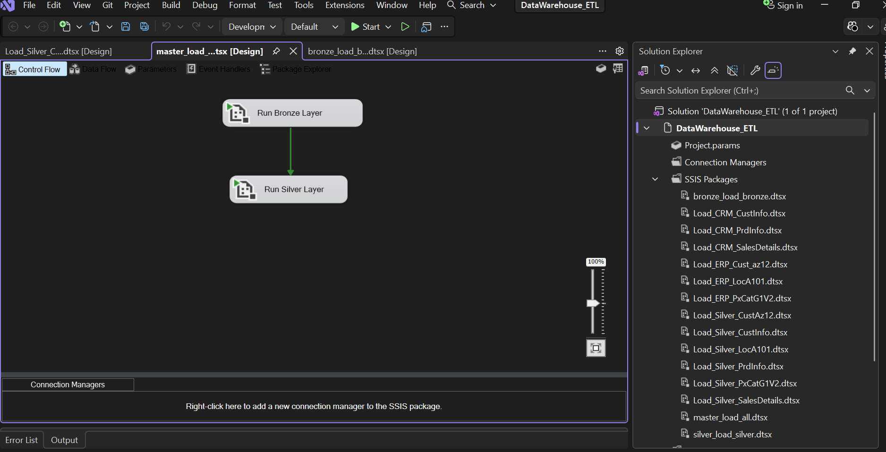
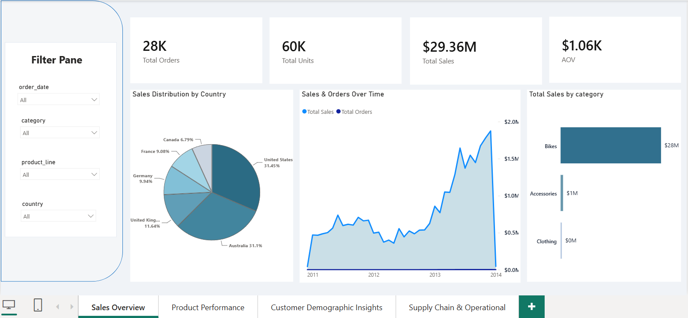

# Data Warehouse and Analytics Project

Building a modern data warehouse with SQL Server — including a T-SQL ETL pipeline, an SSIS ETL pipeline, automated job scheduling, data modeling, and a Power BI analytics layer.

Welcome to the **Data Warehouse and Analytics Project** repository! 🚀
This project demonstrates a comprehensive data warehousing and analytics solution, from building a data warehouse to generating actionable insights. Designed as a portfolio project, it highlights industry best practices in data engineering and analytics.

## 🧰 Tech Stack

`SQL Server` · `T-SQL` · `SSIS (SQL Server Integration Services)` · `SQL Server Agent` · `Power BI`

---

## Data Architecture


The data architecture for this project follows Medallion Architecture: **Bronze**, **Silver**, and **Gold** layers:

1. **Bronze Layer**: Stores raw data as-is from the source systems. Data is ingested from CSV files into the SQL Server database.
2. **Silver Layer**: This layer includes data cleansing, standardization, and normalization processes to prepare data for analysis.
3. **Gold Layer**: Houses business-ready data modeled into a star schema required for reporting and analytics.

---

## 🛠️ Data Engineering (Building the Data Warehouse)

### 🎯 Objective

To develop a centralized data warehouse that consolidates disparate sales data, enabling reliable analytical reporting and business intelligence.

### 📋 Specifications & Scope

- **Data Sources:** Ingestion and integration of data from two distinct source systems provided as CSV files:
  - **ERP (Enterprise Resource Planning):** Core transactional and operational sales data.
  - **CRM (Customer Relationship Management):** Customer profiles and interaction data.
- **Data Quality & Cleansing:** Implementation of preprocessing pipelines to identify, cleanse, and resolve data quality issues (e.g., missing values, duplicates, formatting inconsistencies) prior to loading into the final model.
- **Integration & Modeling:** Merging both sources into a unified, optimized data model tailored specifically for analytical queries.
- **Scope Limitation:** Focused strictly on the **latest dataset only**. Historization (SCDs / tracking historical changes) is explicitly out of scope for this phase.
- **Documentation:** Comprehensive documentation of the final data model schemas to support both business stakeholders and downstream analytics teams.

The T-SQL implementation of this pipeline (DDL, load procedures, and transformations for all three layers) lives in [`scripts/`](scripts).

---

## 🔄 ETL Orchestration with SSIS

To complement the T-SQL scripts, this project also includes an SSIS (SQL Server Integration Services) implementation of the same ETL logic, built in Visual Studio.

**Package structure:**

- **Bronze layer:** 6 packages, one per source table (CRM Customer Info, CRM Product Info, CRM Sales Details, ERP Customer, ERP Location, ERP Product Category), each loading raw CSV data into the Bronze schema.
  - Orchestrated by `master_load_bronze.dtsx`, which executes all 6 in sequence.
- **Silver layer:** 6 corresponding packages that cleanse, standardize, and transform Bronze data into Silver.
  - Orchestrated by `master_load_silver.dtsx`, which executes all 6 in sequence.
- **Master control flow:** `master_load_all.dtsx` executes `master_load_bronze.dtsx` followed by `master_load_silver.dtsx`, giving a single entry point that runs the full Bronze → Silver pipeline end to end.

📁 [View SSIS project](ssis/DataWarehouse_ETL)



---

## ⏱️ Job Scheduling (SQL Server Agent)

The end-to-end load is automated using a SQL Server Agent job, so the warehouse refreshes on a schedule without manual intervention.

- **Job:** executes the master SSIS package (`master_load_all.dtsx`) to run the full Bronze → Silver load.
- **Schedule:** *(add your schedule here — e.g. daily at 2:00 AM)*
- **Job scripts:** the job definition is scripted out as `.sql` and version-controlled , so the schedule and steps are reproducible from source control rather than only living inside SSMS.

---

## 📊 Data Analysis (BI, Analytics & Reporting)

### 🎯 Objective

To develop robust, high-performance SQL-based analytics that extract actionable business intelligence from the consolidated data warehouse.

The reporting layer delivers detailed insights into three critical business pillars:

1. **Customer Behavior:** Analyzing purchasing patterns, customer segmentation, and engagement metrics.
2. **Product Performance:** Identifying top-performing products, revenue contributors, and inventory/sales velocity.
3. **Sales Trends:** Evaluating sales performance over time to detect seasonality, growth trajectories, and market shifts.

---

## 📈 Power BI Dashboard

A 4-page Power BI report sits on top of the Gold layer for reporting and analysis:

1. **Sales Overview** — total orders, total units, total sales, and average order value (AOV) at a glance, plus sales & orders trend over time, sales distribution by country, and total sales by category.
2. **Product Performance** 
3. **Customer Demographic Insights** 
4. **Supply Chain & Operational** 

📁 [View Power BI file](powerbi/sales_dashboard.pbix)



---

## 📂 Repository Structure

```
sql_data_warehouse_project/
├── datasets/              # Raw source CSV files (ERP & CRM)
├── docs/                  # Architecture diagrams & README screenshots
│   └── screenshots/
├── scripts/                # T-SQL DDL and ETL scripts (Bronze, Silver, Gold)
├── tests/                  # Data quality checks
├── ssis/
│   └── DataWarehouse_ETL/  # Visual Studio SSIS solution & .dtsx packages
├── sql_agent/
│   └── job_scripts/        # Scripted SQL Server Agent job definitions
├── powerbi/
│   └── sales_dashboard.pbix
├── LICENSE
└── README.md
```

---

## License

This project is licensed under the [MIT License](LICENSE).
